# AWS ACM Private Certificate Authority (PCA) Connector for Active Directory

## 🎯 Problem Statement

Organizations struggle with **manual certificate management** in both hybrid and cloud-native environments where:

- **Certificate Lifecycle Management** is complex and error-prone
- **PKI Integration** between AWS services and Active Directory (on-premises or AWS Managed Microsoft AD) is fragmented  
- **Security Compliance** requires centralized certificate authority control
- **Operational Overhead** from manual certificate enrollment and renewal processes
- **Scalability Issues** when managing certificates across thousands of devices/users
- **Cloud Migration** challenges when moving AD-dependent applications to AWS

## 💡 Solution Overview

The **AWS ACM PCA Connector for Active Directory** provides an automated, secure bridge between AWS Private Certificate Authority and Active Directory (both on-premises and AWS Managed Microsoft AD), enabling:

✅ **Automated Certificate Enrollment** via Group Policy  
✅ **Centralized PKI Management** through AWS ACM PCA  
✅ **Enterprise-Grade Security** with fine-grained access controls  
✅ **Flexible Deployment**: Works with on-premises AD, AWS Managed Microsoft AD, or hybrid scenarios  
✅ **Cloud-Native Integration** for fully AWS-hosted environments  
✅ **Cost Optimization** through AWS managed services  

## 🏗️ Architecture Overview

### 🌐 Hybrid Architecture (On-Premises + AWS)

```mermaid
graph TB
    subgraph "🏢 On-Premises Environment"
        AD[🏛️ Active Directory<br/>Domain Controller]
        DC[💻 Domain Computers]
        DU[👤 Domain Users]
        SC[🔐 Smart Cards]
    end
    
    subgraph "☁️ AWS Cloud Environment"
        subgraph "🔒 VPC (10.192.0.0/16)"
            subgraph "🛡️ Security Group"
                CONN[🔗 PCA Connector<br/>ACM-PCA-AD-Connector]
            end
        end
        
        subgraph "🏛️ AWS Services"
            PCA[📜 Private Certificate Authority<br/>Root CA]
            IAM[🔑 IAM Service Role<br/>Fine-grained Permissions]
            CW[📊 CloudWatch Logs<br/>Audit & Monitoring]
        end
    end
    
    subgraph "📋 Certificate Templates"
        CT1[💻 Computer Certificates<br/>Machine Authentication]
        CT2[👤 User Certificates<br/>User Authentication]
        CT3[🌐 Web Server Certificates<br/>TLS/SSL]
        CT4[✍️ Code Signing Certificates<br/>Application Signing]
        CT5[📧 Email Certificates<br/>S/MIME]
        CT6[🔐 Smart Card Certificates<br/>Strong Authentication]
        CT7[🎫 Enrollment Agent<br/>Certificate Delegation]
    end
    
    %% Connections
    AD -.->|🔐 LDAPS/RPC<br/>Port 636, 135| CONN
    CONN <-->|🔒 HTTPS<br/>Port 443| PCA
    CONN -->|📝 Logging| CW
    IAM -->|🔑 Permissions| CONN
    
    DC -->|📜 Auto-Enroll| CT1
    DU -->|📜 Manual Enroll| CT2
    CT1 & CT2 & CT3 & CT4 & CT5 & CT6 & CT7 -.->|📋 Templates| CONN
    
    %% Styling
    classDef aws fill:#FF9900,stroke:#232F3E,stroke-width:2px,color:#fff
    classDef onprem fill:#4CAF50,stroke:#2E7D32,stroke-width:2px,color:#fff
    classDef security fill:#F44336,stroke:#C62828,stroke-width:2px,color:#fff
    classDef templates fill:#9C27B0,stroke:#6A1B9A,stroke-width:2px,color:#fff
    
    class PCA,IAM,CW,CONN aws
    class AD,DC,DU,SC onprem
    class CONN security
    class CT1,CT2,CT3,CT4,CT5,CT6,CT7 templates
```



### ☁️ Pure AWS Cloud Architecture (AWS Managed Microsoft AD)

```mermaid
graph TB
    subgraph "☁️ AWS Cloud Environment"
        subgraph "🔒 VPC (10.192.0.0/16)"
            subgraph "🏛️ AWS Managed Microsoft AD"
                AWSAD[🏛️ AWS Managed AD<br/>Fully Managed Domain Controllers]
                ADDC1[🖥️ Primary DC<br/>AZ-1a]
                ADDC2[🖥️ Secondary DC<br/>AZ-1b]
            end
            
            subgraph "💻 EC2 Instances"
                EC2WIN1[🖥️ Windows Server 1<br/>Domain Joined]
                EC2WIN2[🖥️ Windows Server 2<br/>Domain Joined]
                EC2WS1[💻 Workstation 1<br/>WorkSpaces/AppStream]
            end
            
            subgraph "🛡️ Security Group"
                CONN[🔗 PCA Connector<br/>ACM-PCA-AD-Connector]
            end
        end
        
        subgraph "🏛️ AWS Services"
            PCA[📜 Private Certificate Authority<br/>Root CA]
            IAM[🔑 IAM Service Role<br/>Fine-grained Permissions]
            CW[📊 CloudWatch Logs<br/>Audit & Monitoring]
            WS[🖥️ WorkSpaces<br/>Virtual Desktops]
            AS[📱 AppStream 2.0<br/>Application Streaming]
        end
    end
    
    subgraph "📋 Certificate Templates"
        CT1[💻 Computer Certificates<br/>EC2 Machine Authentication]
        CT2[👤 User Certificates<br/>WorkSpaces User Authentication]
        CT3[🌐 Web Server Certificates<br/>Internal Load Balancers]
        CT4[✍️ Code Signing Certificates<br/>Lambda/Container Signing]
        CT5[📧 Email Certificates<br/>SES S/MIME Integration]
        CT6[🔐 Smart Card Certificates<br/>MFA Authentication]
        CT7[🎫 Enrollment Agent<br/>Automated Provisioning]
    end
    
    %% Connections
    AWSAD -.->|🔐 LDAPS/RPC<br/>Port 636, 135| CONN
    ADDC1 & ADDC2 -.->|🔄 Replication| AWSAD
    CONN <-->|🔒 HTTPS<br/>Port 443| PCA
    CONN -->|📝 Logging| CW
    IAM -->|🔑 Permissions| CONN
    
    EC2WIN1 & EC2WIN2 -->|📜 Auto-Enroll| CT1
    EC2WS1 -->|📜 Manual Enroll| CT2
    WS & AS -.->|👤 User Sessions| AWSAD
    CT1 & CT2 & CT3 & CT4 & CT5 & CT6 & CT7 -.->|📋 Templates| CONN
    
    %% Styling
    classDef aws fill:#FF9900,stroke:#232F3E,stroke-width:2px,color:#fff
    classDef awsad fill:#00BCD4,stroke:#006064,stroke-width:2px,color:#fff
    classDef compute fill:#4CAF50,stroke:#2E7D32,stroke-width:2px,color:#fff
    classDef security fill:#F44336,stroke:#C62828,stroke-width:2px,color:#fff
    classDef templates fill:#9C27B0,stroke:#6A1B9A,stroke-width:2px,color:#fff
    
    class PCA,IAM,CW,WS,AS aws
    class AWSAD,ADDC1,ADDC2 awsad
    class EC2WIN1,EC2WIN2,EC2WS1 compute
    class CONN security
    class CT1,CT2,CT3,CT4,CT5,CT6,CT7 templates
```



## 🔄 Certificate Enrollment Sequence Diagram

```mermaid
sequenceDiagram
    participant 💻 as Domain Computer
    participant 🏛️ as Active Directory
    participant 🔗 as PCA Connector
    participant 📜 as AWS PCA
    participant 🔑 as IAM Role
    participant 📊 as CloudWatch
    
    Note over 💻,📊: 🚀 Automated Certificate Enrollment Process
    
    💻->>🏛️: 1️⃣ Request Certificate via Group Policy
    Note right of 💻: 🔄 Auto-enrollment triggered<br/>by Group Policy refresh
    
    🏛️->>🔗: 2️⃣ Forward Certificate Request
    Note right of 🏛️: 🔐 Authenticated via<br/>LDAPS (Port 636)
    
    🔗->>🔑: 3️⃣ Assume Service Role
    Note right of 🔗: 🛡️ Fine-grained permissions<br/>for PCA operations
    
    🔗->>📜: 4️⃣ Issue Certificate Request
    Note right of 🔗: 📋 Using predefined<br/>certificate template
    
    📜->>📜: 5️⃣ Generate Certificate
    Note right of 📜: 🔒 RSA 2048-bit key<br/>SHA-256/512 signature
    
    📜->>🔗: 6️⃣ Return Signed Certificate
    Note right of 📜: ✅ Certificate issued<br/>with validity period
    
    🔗->>📊: 7️⃣ Log Certificate Issuance
    Note right of 🔗: 📝 Audit trail for<br/>compliance tracking
    
    🔗->>🏛️: 8️⃣ Deliver Certificate
    Note right of 🔗: 🔐 Secure delivery via<br/>encrypted channel
    
    🏛️->>💻: 9️⃣ Install Certificate
    Note right of 🏛️: 💾 Certificate stored in<br/>Computer/User store
    
    Note over 💻,📊: ✅ Certificate Successfully Enrolled & Installed
    
    %% Styling
    rect rgb(255, 153, 0, 0.1)
        Note over 🔗,📜: AWS Cloud Services
    end
    
    rect rgb(76, 175, 80, 0.1)
        Note over 💻,🏛️: On-Premises Infrastructure
    end
```



## 🔧 Network Security Architecture

```mermaid
graph TB
    subgraph "🌐 Internet"
        INT[🌍 Internet Gateway]
    end
    
    subgraph "☁️ AWS VPC (10.192.0.0/16)"
        subgraph "🔒 Private Subnet"
            subgraph "🛡️ Security Group Rules"
                SG[🔐 ACM-PCA-AD-SecurityGroup]
            end
            
            CONN[🔗 PCA Connector<br/>ENI: 10.192.1.100]
        end
        
        subgraph "📡 VPC Endpoints"
            VPCE1[🔗 ACM PCA Endpoint]
            VPCE2[🔗 IAM Endpoint]
            VPCE3[🔗 CloudWatch Endpoint]
        end
    end
    
    subgraph "🏢 On-Premises Network"
        subgraph "🏛️ Domain Controllers"
            DC1[🖥️ Primary DC<br/>10.192.1.10]
            DC2[🖥️ Secondary DC<br/>10.192.1.11]
        end
        
        subgraph "💻 Client Machines"
            PC1[💻 Workstation 1]
            PC2[💻 Workstation 2]
            PC3[📱 Laptop 1]
        end
    end
    
    subgraph "🔐 Security Rules"
        INBOUND["📥 INBOUND RULES<br/>
        🔒 Port 443 (HTTPS) ← VPC CIDR<br/>
        🔒 Port 135 (RPC) ← AD Subnets<br/>
        🔒 Port 49152-65535 (Dynamic RPC) ← AD Subnets<br/>
        🔒 Port 389 (LDAP) ← AD Subnets<br/>
        🔒 Port 636 (LDAPS) ← AD Subnets"]
        
        OUTBOUND["📤 OUTBOUND RULES<br/>
        🔒 Port 443 (HTTPS) → 0.0.0.0/0 (AWS APIs)<br/>
        🔒 Port 135 (RPC) → VPC CIDR<br/>
        🔒 Port 49152-65535 (Dynamic RPC) → VPC CIDR<br/>
        🔒 Port 389 (LDAP) → VPC CIDR<br/>
        🔒 Port 636 (LDAPS) → VPC CIDR<br/>
        🔒 Port 53 (DNS) → VPC CIDR"]
    end
    
    %% Connections
    DC1 & DC2 -.->|🔐 LDAPS:636<br/>RPC:135| CONN
    PC1 & PC2 & PC3 -.->|📜 Certificate Requests| DC1
    CONN <-->|🔒 HTTPS:443| VPCE1
    CONN <-->|🔒 HTTPS:443| VPCE2
    CONN <-->|🔒 HTTPS:443| VPCE3
    
    SG -.->|🛡️ Controls| INBOUND
    SG -.->|🛡️ Controls| OUTBOUND
    
    %% Styling
    classDef aws fill:#FF9900,stroke:#232F3E,stroke-width:3px,color:#fff
    classDef onprem fill:#4CAF50,stroke:#2E7D32,stroke-width:3px,color:#fff
    classDef security fill:#F44336,stroke:#C62828,stroke-width:3px,color:#fff
    classDef network fill:#2196F3,stroke:#1565C0,stroke-width:3px,color:#fff
    
    class CONN,VPCE1,VPCE2,VPCE3 aws
    class DC1,DC2,PC1,PC2,PC3 onprem
    class SG,INBOUND,OUTBOUND security
    class INT network
```



## 📋 Certificate Template Architecture


## 🎯 Use Cases & Applications

| Use Case | Templates |
|----------|----------|
| Zero Trust Security | Computer, User, Smart Card |
| Internal Web Services Security | Server, Web Server |
| Software Development Security | Code Signing |
| Cloud Migration & Modernization | All templates |
| Healthcare – Device Auth & S/MIME | Computer, Email (S/MIME) |
| Financial Services – Code Signing & Smart Card | Code Signing, Smart Card |
| Manufacturing – IoT & Firmware Signing | Computer, Code Signing |
| Education – BYOD & Research Protection | Computer, Email (S/MIME) |
| Virtual Desktop Infrastructure | User, Smart Card |
| Analytics & Data – Redshift, RDS, Kinesis | Client certificates |

## 🔧 Implementation Sequence

```mermaid
sequenceDiagram
    participant 👨‍💻 as Administrator
    participant ☁️ as AWS CloudShell
    participant 🔧 as Deployment Script
    participant 🏛️ as AWS Services
    participant 🔗 as PCA Connector
    participant 📋 as Certificate Templates
    
    Note over 👨‍💻,📋: 🚀 Complete Deployment Sequence
    
    👨‍💻->>☁️: 1️⃣ Execute connector_ad.sh
    Note right of 👨‍💻: 🔧 Run automated<br/>deployment script
    
    ☁️->>🔧: 2️⃣ Initialize Deployment
    Note right of ☁️: ✅ Validate prerequisites<br/>and environment
    
    🔧->>🏛️: 3️⃣ Create Security Group
    Note right of 🔧: 🛡️ Configure network<br/>security rules
    
    🔧->>🏛️: 4️⃣ Create IAM Service Role
    Note right of 🔧: 🔑 Fine-grained<br/>permissions setup
    
    🔧->>🏛️: 5️⃣ Deploy PCA Connector
    Note right of 🔧: 🔗 Create connector<br/>with VPC integration
    
    🏛️->>🔗: 6️⃣ Connector Activation
    Note right of 🏛️: ⏱️ Wait for ACTIVE<br/>status (2-5 minutes)
    
    🔧->>🏛️: 7️⃣ Create Service Principal Name
    Note right of 🔧: 🎫 AD integration<br/>authentication setup
    
    🔧->>📋: 8️⃣ Deploy Certificate Templates
    Note right of 🔧: 📋 Create 9 different<br/>certificate templates
    
    📋->>🔗: 9️⃣ Configure Access Control
    Note right of 📋: 🔐 Set domain SID<br/>permissions
    
    🔗->>👨‍💻: 🔟 Deployment Complete
    Note right of 🔗: ✅ Ready for certificate<br/>enrollment operations
    
    Note over 👨‍💻,📋: 🎉 PKI Infrastructure Successfully Deployed
    
    %% Styling with colors
    rect rgb(255, 153, 0, 0.1)
        Note over 🏛️,📋: AWS Cloud Infrastructure
    end
    
    rect rgb(76, 175, 80, 0.1)
        Note over 👨‍💻,🔧: Administrative Operations
    end
```



## 🔍 Monitoring & Compliance

### 📊 **CloudWatch Integration**
- **Certificate Issuance Metrics**: Track certificate enrollment success/failure rates
- **Performance Monitoring**: Monitor connector response times and availability
- **Security Auditing**: Log all certificate operations for compliance

### 🛡️ **Security Best Practices**
- **Principle of Least Privilege**: Fine-grained IAM permissions
- **Network Segmentation**: VPC isolation with security groups
- **Encryption in Transit**: All communications encrypted via HTTPS/LDAPS
- **Access Control**: Domain SID-based template permissions

### 📋 **Compliance Features**
- **Audit Trails**: Complete logging of certificate lifecycle events
- **Template Governance**: Standardized certificate templates with approval workflows
- **Access Reviews**: Regular review of certificate template permissions
- **Certificate Lifecycle Management**: Automated renewal and revocation processes

## 🚀 Getting Started

### Prerequisites
- ✅ AWS Account with appropriate permissions
- ✅ Active Directory Domain Services
- ✅ VPC with connectivity to on-premises AD
- ✅ AWS Private Certificate Authority deployed

### Quick Deployment
```bash
# 1. Clone and execute the deployment script
chmod +x connector_ad.sh
./connector_ad.sh

# 2. Verify deployment
aws pca-connector-ad list-connectors

# 3. Test certificate enrollment via Group Policy
gpupdate /force
```

## 💰 Cost Optimization

- **AWS PCA**: Pay-per-certificate model with volume discounts
- **Connector**: No additional charges for the connector service
- **Network**: VPC endpoint usage for reduced data transfer costs
- **Automation**: Reduced operational overhead through automation

---

## 🎆 **Deployment Flexibility**

### 🌐 **Hybrid Deployments**
- On-premises Active Directory + AWS PCA
- Existing AD infrastructure with cloud PKI services
- Gradual cloud migration scenarios

### ☁️ **Pure AWS Cloud Deployments**
- AWS Managed Microsoft AD + AWS PCA
- Cloud-native applications and services
- WorkSpaces, AppStream, EC2, containers, serverless

### 🔄 **Migration Scenarios**
- Lift-and-shift AD-dependent applications
- Modernization with cloud-native PKI
- Hybrid during transition periods

#### Notes 


### AWS Private CA Connector

**How it works:**
- Creates **standard Windows AD objects** using existing schema
- Uses `certificationAuthority`, `pKICertificateTemplate`, `pKIEnrollmentService` object classes
- No schema extensions required
- Apps can discover these through standard LDAP queries

**AD Objects Created by Connector:**
```
CN=Certification Authorities,CN=Public Key Services,CN=Services,CN=Configuration,DC=domain,DC=com
└── CN=<ConnectorName>-CA
    ├── objectClass: certificationAuthority (STANDARD)
    ├── displayName: "AWS Private CA via Connector"
    └── dNSHostName: "vpce-<id>-<hash>.pca-connector-ad.<region>.vpce.amazonaws.com"

CN=Certificate Templates,CN=Public Key Services,CN=Services,CN=Configuration,DC=domain,DC=com
├── CN=WorkstationCertificateTemplate
├── CN=LaptopCertificateTemplate
├── CN=InfrastructureServerTemplate
├── CN=UserAuthenticationTemplate
├── CN=WebServerTemplate
├── CN=CodeSigningTemplate
├── CN=EmailTemplate
├── CN=EnrollmentAgentTemplate
└── CN=SmartCardTemplate (all use standard pKICertificateTemplate class)

CN=Enrollment Services,CN=Public Key Services,CN=Services,CN=Configuration,DC=domain,DC=com
└── CN=<ConnectorName>-EnrollmentService (standard pKIEnrollmentService class)
```


## 🔍 **Verification Section**

### **Certificate Authority Verification**
```powershell
# Verify AWS PCA Connector registration in Active Directory
# This command lists all Certificate Authorities registered in AD Configuration partition
# Should show both on-premises CA (if any) and AWS PCA Connector, or Only AWS PCA Connector
Get-ADObject -Filter "objectClass -eq 'certificationAuthority'" -SearchBase "CN=Certification Authorities,CN=Public Key Services,CN=Services,CN=Configuration,$((Get-ADDomain).DistinguishedName)"
```

### **Detailed CA Information**
```powershell
# Get comprehensive details about registered Certificate Authorities
# Displays CA display names, DNS hostnames, and descriptions
# Helps identify AWS PCA Connector vs traditional ADCS CAs
Get-ADObject -Filter "objectClass -eq 'certificationAuthority'" -SearchBase "CN=Certification Authorities,CN=Public Key Services,CN=Services,CN=Configuration,$((Get-ADDomain).DistinguishedName)" -Properties displayName,dNSHostName,description
```

### **Certificate Template Verification**
```powershell
# Verify certificate templates created by the deployment script
# Should show all 9 templates: Computer, Laptop, Server, User, Email, Smart Card, Web Server, Code Signing, Enrollment Agent
# Confirms successful template deployment and AD integration
Get-ADObject -Filter "objectClass -eq 'pKICertificateTemplate'" -SearchBase "CN=Certificate Templates,CN=Public Key Services,CN=Services,CN=Configuration,$((Get-ADDomain).DistinguishedName)" -Properties displayName | Select-Object Name,displayName
```


## GPO Configuration for AWS PCA Connector

### GPO Configuration Steps:

1. **Open GPMC** → Create new GPO: "AWS PCA Certificate Auto-Enrollment"

2. **Navigate to:**
   ```
   Computer Configuration → Policies → Windows Settings → Security Settings → Public Key Policies
   ```

3. **Configure Certificate Services Client - Auto-Enrollment:**
   - Configuration Model: **Enabled**
   - ✓ Renew expired certificates, update pending certificates, and remove revoked certificates
   - ✓ Update certificates that use certificate templates

4. **Configure Certificate Enrollment Policy:**
   - Right-click "Certificate Enrollment Policy" → Properties
   - **Policy Server URL:** `https://<vpc-endpoint-url>/ADPolicyProvider_CEP_Kerberos/service.svc/CEP`
   - **Authentication:** Kerberos

### Available Certificate Templates from Script:
- WorkstationCertificateTemplate
- LaptopCertificateTemplate  
- InfrastructureServerTemplate
- UserAuthenticationTemplate
- WebServerTemplate
- CodeSigningTemplate
- EmailTemplate
- EnrollmentAgentTemplate
- SmartCardTemplate

### Registry Configuration (Alternative):
```reg
[HKEY_LOCAL_MACHINE\SOFTWARE\Policies\Microsoft\Cryptography\AutoEnrollment]
"AEPolicy"=dword:00000007

[HKEY_LOCAL_MACHINE\SOFTWARE\Policies\Microsoft\Cryptography\PolicyServers]
"Flags"=dword:00000020

[HKEY_LOCAL_MACHINE\SOFTWARE\Policies\Microsoft\Cryptography\PolicyServers\<policy-server-hash>]
"URL"="https://<vpc-endpoint-url>/ADPolicyProvider_CEP_Kerberos/service.svc/CEP"
"AuthFlags"=dword:00000002
"Flags"=dword:00000020
```

### Verification Commands:
```cmd
# Check certificate auto-enrollment status
certlm.msc

# Force certificate enrollment
gpupdate /force
certreq -enroll -machine -q

# View enrollment policy
certutil -PolicyCache display
```

